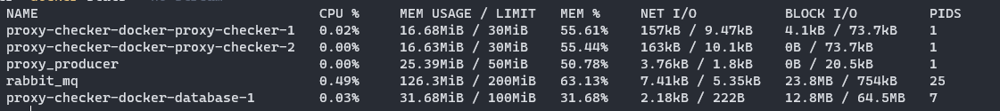

# proxy-checker-docker

Комплект по проверке прокси адресов. Включает в себя:

* [proxy-checker](https://github.com/Ichinya/proxy_cheker) - проверка прокси, потребляем примерно 15мб ОЗУ на каждый
* [proxy-producer](https://github.com/Ichinya/proxy_producer) - собирает списки прокси и отправляет на проверку, потребляет примерно 30мб ОЗУ. Плюс образ крона 4-5 мегабайт. При импорте используется ещё 100Мб.
* rabbitmq - менеджер очередей, через него происходит отправка на проверку. Уходит на работа 150Мб.
* postgresql - база данных для хранения списков и результатов. Нужно для работы примерно 30мб ОЗУ, но тут зависит от количества прокси

Текущая композиция занимает 250Мб ОЗУ и 900метров готовые образы. На каждый новый чекер добавляется 15Мб ОЗУ. То есть при работе с 512Мб можно запустить 10-20 чекеров. 10 чекеров могут проверить 8к-10к прокси за час.



## Запуск

Запускаем сборку. Также создаться два сервиса из образа proxy-producer, это producer_import и producer_cron. Первый при запуске проверяет сайт со списками прокси и вносит в базу. Второй запускает крон - отправка в очередь на проверку прокси, плюс переотправляет прокси на проверку каждые сутки

```shell
git clone https://github.com/Ichinya/proxy-checker-docker.git .

docker compose -f "docker-compose.yaml" up -d --build 
```

Команда импорта списков прокси с сайтов, собирает примерно 20-24к прокси с разных сайтов
```shell
docker exec proxy_producer python3 update_list_proxy.py
```

Для подключения к RabbitMQ, нужно использовать образ `rabbitmq:management-alpine` вместо `rabbitmq:alpine` и добавить порты к сервису:
```yaml
    ports:
      - 5672:5672
      - 15672:15672
```

Для редактирования и просмотра базы данных можно открыть порт 5432 в сервисе или использовать допонительный образ Docker SQLPad, просто нужно добавить в композицию новый сервис, логин и пароль some@think.ru и пароль password:
```yaml

  sqlpad:
    image: sqlpad/sqlpad:latest
    container_name: sqlpad
    ports:
      - 3000:3000
    environment:
      SQLPAD_ADMIN: 'some@think.ru'
      SQLPAD_ADMIN_PASSWORD: 'password'
      SQLPAD_APP_LOG_LEVEL: info
      SQLPAD_WEB_LOG_LEVEL: warn
      SQLPAD_CONNECTIONS__sqlserverdemo__name: DB
      SQLPAD_CONNECTIONS__sqlserverdemo__driver: postgres
      SQLPAD_CONNECTIONS__sqlserverdemo__host: database
      SQLPAD_CONNECTIONS__sqlserverdemo__database: homestead
      SQLPAD_CONNECTIONS__sqlserverdemo__username: user
      SQLPAD_CONNECTIONS__sqlserverdemo__password: pass
    volumes:
      - ./sqlpad-volume:/var/lib/sqlpad
    depends_on:
      - database

```


## Примечания
В файле `docker-compose.yaml` можно найти у proxy-checker `replicas: 2` - это количество чекеров. Каждый потребляем примерно 15-20мегабайт ОЗУ. Если использовать 20 чекеров, то скорость будет примерно 5 прокси в секунду. 

## Возможно появится:
* Работа с файлами. Закидываем файлы со списками, а после проверки - получаем готовый список
* Будет добавлен Gearman, так как кролик немало жрёт ОЗУ.